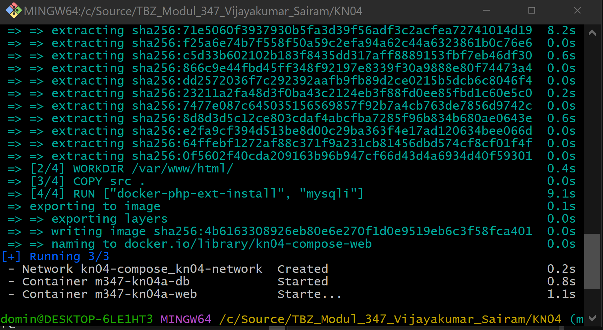

# KN04 - Docker Compose

## A) Docker Compose: Lokal

### Teil A) Verwendung von Original Images

Docker compose up baut / (neu)erstellt, startet und verbindet alle containers, die im docker compose datei definiert werden.

### Teil B) Verwendung Ihrer eigenen Images 

Der Fehler kommt vor, da wir die werte für db login hard codiert haben, können wir nicht einfach verbinden. Wir könnten im Docker Compose eine environment und im db.php die werte von systemvariable benutzten. da ist es viel einfacher, einstellungen setzen

## B) Docker Compose: Cloud

